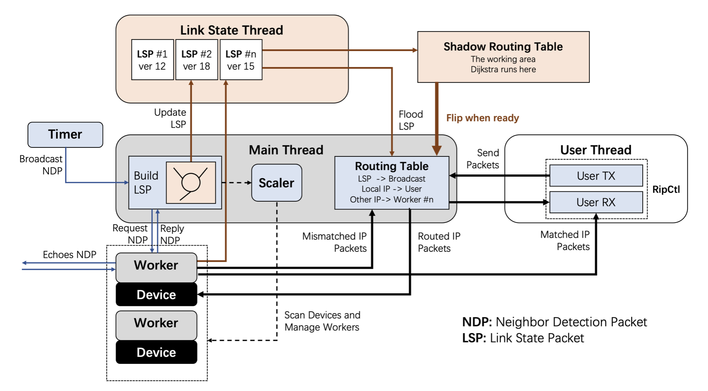

<!-- _paginate: false -->

# Rustify Your Network Stack

CompNet (Honor Track)
Sept. 27th, 2023

---
Everything Available (later) @

https://github.com/EchoStone1101

<br>

Maybe check out my blogs?

https://echostone1101.github.io/RustyBlogs/

---

<!-- paginate: true -->

# Schedule for Today

* Why Rust?

* `[#must_use]`s

* Rust Best Practices

---

# Why Rust?

* ✅ `Segmentaion Fault` free.

* ✅ Race condition free.

* ✅ Robust and *perfect* implementation.

* ✅ Forget about `Makefile`.

* ✅ Wonderful third-party crates.

* 😇 You just love Rust.


---

# `[#must_use]`s

* Crates and Project Management
* Rust FFI and Interpositioning
* Keep it `safe`

---

### `use these::crates;`

<br>

* ✅ `pcap` - wrapper for `libpcap`.

* ✅ `libc` - wrapper for C language types.

<br>

These crates are likely essential.


--- 

### `use these::crates;`

* 🚀 `lazy_static` - global state initialization.

* 🚀 `chrono` - time library.

* 🚀 `log` and `env_logger` - customized logging.

* 🚀 `colored` - color your output.

* 🚀 `clap` - `#derive` based CLI parser.


---

### `crates.io` and `docs.rs` 
### are your best friends!

---

### Effortless Dependency

* `cargo add` all your third-party crates

* Import your layers as crates:

```toml
# In my Cargo.toml for `rip`
[dependencies]
rlink = { path = "../rlink"} # this is manual

timer = "0.2.0"
# ..these are automated
```

---

### Elegant Modules

> `lib.rs` for all your interfaces

```bash
rip
├── src
│   ├── bin
│   ├── "lib.rs"    
│   └── ipv4.rs
└── tests
    └── test_basic.rs
```

```rust
use rlink::*; // this impforts everything from my link layer

/// A library instance. Details are opaque outside this library.
pub struct RipCtl { .. }
impl RipCtl { .. } 
```

---

> `module.rs`, `module/mod.rs`, or both

```bash
rip
├── src
│   ├── bin
│   ├── lib.rs  
│   └── "ipv4.rs"
└── tests
    └── test_basic.rs
```

```rust
// In `lib.rs`
mod ipv4; // add to project tree
use ipv4::Ipv4Header; // import objects

// In `mod.rs`
pub mod sub_module;
pub use sub_module::some_popular_thing;
```

--- 

> `src/bin` for standalone binaries

```bash
rip
└── src
    ├── "bin"
    ├── lib.rs  
    └── ipv4.rs

```
```rust
// `src/bin/gatherer.rs`
let parsed_packet = pool
    .select()
    .unwrap()
    .parse_eth(false)
    .unwrap();

if matches!(parsed_packet.ethtype(), EtherType::IPv4) {
    println!("{}", parsed_packet);
}
```

--- 

> `tests/` for integration tests.

```bash
rip
├── src
│   ├── bin
│   ├── lib.rs 
│   └── ipv4.rs
└── "tests"
    └── "test_basic.rs"
```

`cargo test` to run all tests.

---

# Rust FFI

* Foreign Function Inteface
* Exposing Rust function to be **called** by other code

```rust
use libc::*;

#[no_mangle]
pub extern fn __wrap_send(
    socket: i32, 
    buffer: *const c_void, 
    length: size_t, 
    flags: i32
) -> ssize_t {
    posix_send(socket, buffer, length, flags).unwrap_or(-1)
}
```

---

# Rust FFI: Subtleties

* Use `libc` primitive C types.

* Especially, use C pointers.

* Do **NOT** assume Rust `struct` memory layout.

* Rust `str` is unlike C `char[]`!

<https://doc.rust-lang.org/nomicon/ffi.html>

---

# Interpositioning

> ICS: Replace the function called at Link-Time!

```c
// In `rtcp.c`

#ifndef __RTCP_H
#define __RTCP_H

#include <sys/types.h> 
#include <sys/socket.h> 
#include <netdb.h>

ssize_t __wrap_send(int socket, const void *buffer, size_t length, int flags);

#endif
```

---
In your C `Makefile`:

```makefile
gcc -o $@ $^ unp.c ../csrc/rtcp.c \
		-Wl,--wrap,socket \
		-Wl,--wrap,bind \
		-Wl,--wrap,listen \
		-Wl,--wrap,connect \
		-Wl,--wrap,accept \
		-Wl,--wrap,read \ # `send()` -> `__wrap_send()`
		-Wl,--wrap,write \
		-Wl,--wrap,close \
		-Wl,--wrap,getaddrinfo \
		-Wl,--wrap,send \
		-Wl,--wrap,recv \
		-L/home/echostone/CompNet/rtcp/target/debug -lrtcp
                # ^ link Rust binary (target/debug/librtcp.so)
                # which is put there by `cargo`.
```

--- 

You can even fall back to the original with `__real`:

```c
// In `rtcp.c`
ssize_t __wrap_read(int fildes, void *buf, size_t nbyte) {
    if (__rtcp_fildes_is_sock(fildes)) {
        // recv() with zero flag
        return __wrap_recv(fildes, buf, nbyte, 0);
    }
    return __real_read(fildes, buf, nbyte);
}
```
```rust
// In `lib.rs`
#[no_mangle]
pub extern fn __rtcp_fildes_is_sock(fildes: i32) -> i32 {
    if FD2ID.lock().unwrap().contains_key(&Fd::new(fildes)) { 1 } else { 0 }
}
```

---

Finally, `(constructor)` and `(destructor)`

```c
// Initialize RTCP library.
void __rtcp_init(void);

// This attribute makes the loader invoke this function before main()
// We use this to invoke the initializer of RTCP library.
void __attribute__ ((constructor)) _rtcp_init(void) {
    __rtcp_init();
}

// Cleanup RTCP library.
void __rtcp_fini(void);

// This attribute makes the loader invoke this function after main()
// We use this to invoke the cleanup code of RTCP library.
void __attribute__ ((destructor)) _rtcp_fini(void) {
    __rtcp_fini();
}
```

---

Finally, `(constructor)` and `(destructor)`

```rust
#[no_mangle]
/// Initialize RTCP library, starting the main dispatch thread.
pub extern fn __rtcp_init() { .. }

/// Clean up RTCP library, closing all connections.
#[no_mangle]
pub extern fn __rtcp_fini() { .. }
```
<br>

<https://embeddedartistry.com/blog/2019/04/08/a-general-overview-of-what-happens-before-main/>

---

# Keep it `safe`

> You cannot even write a binary tree in Rust without `unsafe`.

<br>

# No.
(And actually you can.)

---

# Keep it `safe`

* ✅ There is almost always a workaround for `unsafe`.
(or you are really unsafe).

* ✅ Also keep it `stable`, not `nightly`.

* ✅ The only `unsafe` should be in your FFI code.

<br>

> The real danger is not `unsafe` itself. \
It is the boundary in between.

---

# Rust Best Practices

* 🔧 Error Handling for the best `Result`

* 🏎️ Fearless Concurrency

* 💥 Emergence

---

## Error Handling: Level *Bad*

```c
void *area = mmap(
    ADDRESS,                    // address
    4096,                       // len
    PROT_READ|PROT_WRITE,       // protection
    MAP_PRIVATE|MAP_ANONYMOUS,  // flags
    -1,                         // fd
    0                           // file offset
);
if (area == (void *)(-1)) {
    printf("%s\n", strerror(errno));
}
```

Or anything like `printf()` everywhere...

---

## `Option` & `Result`

Earn a million $ back by throwing away `NULL`.

```rust
pub enum Option<T> {
    /// No value.
    None,
    /// Some value of type `T`.
    Some(T),
}

pub enum Result<T, E> {
    /// Contains the success value
    Ok(T),
    /// Contains the error value
    Err(E),
}
```

---

## Error Handling: Level One

```rust
/// Read a packet from this capture handle’s interface. 
/// May or may not block,based on the handle setting.
/// A callback function, if registered, will be invoked 
/// on the packet first. 
/// The callback function might take the packet, hence the 
/// return value is `Option<Packet>` rather than `Packet`.
pub fn next_packet(&mut self) -> Result<Option<Packet<Raw>>, PError> {
    let packet = Packet::<Raw>::from(
        self.cap.next_packet()?, 
        self.mac_address.clone()
    );
    if let Some(func) = &self.callback {
        Ok(func(packet, &self.mac_address))
    }
    else {
        Ok(Some(packet))
    }
}
```

---

## Custom Error Types

```rust
/// Errors beyond `PcapError`
#[derive(Debug)]
pub enum RlinkError {
    /// An invalid device name is requested
    InvalidDeviceName(&'static str),
    /// Payload exceeds maximum frame size
    PayloadTooLarge,
    /// Payload size mismatch with specified length
    PayloadLengthMismatch,
    /// Invalid Packet Format
    InvalidPacket(Packet::<Raw>, &'static str),
    /// Broken Device Pool
    BrokenDevicePool,
}
```

---

## Error Handling: Level Two

```rust
impl fmt::Display for RlinkError {
    // Custom error message
    fn fmt(&self, f: &mut fmt::Formatter) -> fmt::Result { .. }
}
impl Error for RlinkError {}

pub fn send_packet(&mut self, ..) -> Result<(), Box<dyn Error>> { 
    if len >= 1500 {
        return Err(Box::new(RlinkError::PayloadTooLarge));
    }
    // ..
    self.cap.sendpacket(..)?;
}
```
Checkout `thiserror` and `anyhow`!

---

## How Did We Get Here?

```rust
let packet = handle.next_packet();
match &packet {
    Err(e) => {
        // Worker threads seem to report this; neglect it.
        if matches!(e, PError::TimeoutExpired) {
            continue
        }

        println!("worker error: {}", e);
        // ^^^^^^^^^^^^^^^^^^^^^^^^^^^^^
        // what do we do then?
    }
    Some(packet) => { .. }
}
```

---

## Error Handling: Level Three

When to `unwrap()`, when to `?`, and when to `log`.

<br>

* ✅ `unwrap` when it is unlikely to go wrong,
or when we cannot move ahead anyway.
```rust
let mut mg = lsp.lock().unwrap();
```

---

## Error Handling: Level Three

* ✅ `?` when the error can be handled,
when we want to early stop,
and when the error is better reported elsewhere.

```rust
// Should not be unwrapping in constructors..

let cap = Capture::from_device(device.name.as_str())?
    .timeout(timeout)
    .immediate_mode(immediate)
    .open()?;
let mac_address = mac_address::mac_address_by_name(name)?.unwrap();
```

---

## Error Handling: Level Three

`log` the main execution sequence, `?` in secondary functions, and `unwrap` at the main routine.

<br>

<https://doc.rust-lang.org/book/ch09-03-to-panic-or-not-to-panic.html>

--- 

**Case Study**: the panicking system for my compiler.

```rust
pub struct Panic {
    desc: String,
    ..
}

impl Panic {
    /// Ignite the `Panic`.
    pub fn panic(&self, info: &impl PanicInfo) -> ! {
        info.dump();
        panic!("{:?}", self)
    }
}

/// Panicable result with `Panic`.
pub type Panicable<T> = std::result::Result<T, Panic>;
```

---

```rust
// Some very deep routine
fn done(mut self) -> Panicable<SummaryApplier> {
    assert_or_throw!(
        Rc::ptr_eq(&self.cursor, &self.root), 
        "cursor did not return to root"
    );
    assert_or_throw!(
        self.indices.is_empty(), 
        "indices are not all popped"
    );
    assert_or_throw!(
        self.done, 
        "applier is not marked done"
    );

    self.done = false;
    Ok(self)
}
```
---

```rust
// `?` here
pub fn end_apply(&mut self, applier: SummaryApplier, ..) -> Panicable<()> {
    // ..
    traces.msg(format!("finishing applying summary with scope {scope}"));
    match &mut summary.state {
        ..
        SummaryState::Apply(ap) => _ = ap.insert(applier.done()?),
                                                // ^^^^^^^^^^^^^^
    }
    Ok(())
}

// In the main routine
self.sman
    .end_apply(ap, &mut self.traces)
    .unwrap_or_else(|panic| panic.panic(&self.traces));
//  ^^^^^^^^^^^^^^^^^^^^^^^^^^^^^^^^^^^^^^^^^^^^^^^^^^
```
Now I see both the traces (how we get here), 
 and the error (where it happened).

---

## Fearless Concurrency

```rust
lazy_static! {
    /// Array of TCBs. 
    /// Entry of None indicates the index is available
    /// for a new socket_fd.
    pub static ref TCBS: Vec<Arc<TCB>> = { .. };
}

/// The Transmission Control Block, one for each endpoint of a 
/// TCP connection. 
#[derive(Debug)]
pub struct TCB {
    pub inner: Mutex<Option<_TCB>>,

    /// Requests pend on this condition for delayed processing.
    /// Note that the notification is not guaranteed to be FIFO.
    pub retry: Condvar,
}
```

---

It all starts with a global state:
```rust
static STATE: i32 = 0;
```

It is by default immutable, 
so it's not very interesting or useful.

---

Let's make it `mut`!

```rust
static mut STATE: i32 = 0;

fn mutate_state() {
    STATE = 1;
}   
```
Oops! What do we do then?
```bash
error[E0133]: use of mutable static is unsafe and requires unsafe 
function or block
  --> src/middleend/se.rs:34:5
   |
34 |     STATE = 1;
   |     ^^^^^^^^^ use of mutable static
   |
   = note: mutable statics can be mutated by multiple threads: 
   aliasing violations or data races will cause undefined behavior
```

---

```rust
static mut STATE: i32 = 0;

fn mutate_state() {
    STATE = 1;
}   
```

Every thread will hold the ownership of `STATE`, 
which is very `unsafe`.

<br> 

Use a smart pointer object to hold the ownership instead!

---

```rust
use std::rc::Rc;
// `Rc` stands for Reference-Counted. It's similar to std::shared_ptr.

static STATE: Rc<i32> = Rc::new(0);
```
```bash
error[E0277]: `Rc<i32>` cannot be shared between threads safely
  --> src/middleend/se.rs:31:15
   |
31 | static STATE: Rc<i32> = Rc::new(0);
   |               ^^^^^^^ `Rc<i32>` cannot be shared between threads safely
   |
   = help: the trait `Sync` is not implemented for `Rc<i32>`
   = note: shared static variables must have a type that implements `Sync`
```

---

```rust
use std::sync::Arc;
// `Arc` stands for Atomic Reference-Counted. 

static STATE: Arc<i32> = Arc::new(0);
```
```bash
error[E0015]: cannot call non-const fn `Arc::<i32>::new` in statics
  --> src/middleend/se.rs:32:26
   |
32 | static STATE: Arc<i32> = Arc::new(0);
   |                          ^^^^^^^^^^^
   |
   = note: calls in statics are limited to constant functions, 
   tuple structs and tuple variants
   = note: consider wrapping this expression in `Lazy::new(|| ...)` 
   from the `once_cell` crate: https://crates.io/crates/once_cell
```

---

```rust
use lazy_static::*;
lazy_static! {
    static ref STATE: Arc<i32> = Arc::new(0);
}

fn mutate_state() {
    STATE = 1; // ? It does not work...
}
```
We need to borrow the inside of an `Arc`.
This concept is called `Cell`s.

---
```rust
use std::cell::RefCell;

lazy_static! {
    static ref STATE: Arc<RefCell<i32>> = Arc::new(
        RefCell::new(0)
    );
}

fn mutate_state() {
    STATE.borrow_mut() = 1;
}
```
```bash
error[E0277]: `RefCell<i32>` cannot be shared between threads safely
  --> src/middleend/se.rs:34:1
   |
34 | / lazy_static! {
35 | |     static ref STATE: Arc<RefCell<i32>> = Arc::new(RefCell::new(0));
36 | | }
   | |_^ `RefCell<i32>` cannot be shared between threads safely
   |
   = help: the trait `Sync` is not implemented for `RefCell<i32>`
```

---
```rust
use std::sync::Mutex;

lazy_static! {
    static ref STATE: Arc<Mutex<i32>> = Arc::new(Mutex::new(0));
}

fn mutate_state() {
    let mut guard = STATE.lock().unwrap();
    *guard = 1;
}
```

Now it works!
And we arrive at `Arc<Mutex<_>>`...

---
This should make sense now!
```rust
lazy_static! {
    /// Array of TCBs. 
    /// Entry of None indicates the index is available
    /// for a new socket_fd.
    pub static ref TCBS: Vec<Arc<TCB>> = { .. };
}

/// The Transmission Control Block, one for each endpoint of a 
/// TCP connection. 
#[derive(Debug)]
pub struct TCB {
    pub inner: Mutex<Option<_TCB>>,

    /// Requests pend on this condition for delayed processing.
    /// Note that the notification is not guaranteed to be FIFO.
    pub retry: Condvar,
}
```

---

## Fearless Concurrency


*  ✅ Think ownership. 
One and only one thing takes it.
In fact, avoid global states in general.

*  ✅ If you must, `Arc<Mutex<_>>` is the standard way.
Not even `Mutex`, if immutable.

*  ✅ The Rust compiler can be *very* helpful!

---

## Emergence

> When you feel hindered by Rust's rules,
take a step back.
More than often, it is YOU doing it wrong.

<br>

The best code design *emerges* naturally.

<https://www.youtube.com/watch?v=v6RxJsk8otY>

---

### Network Layer Design

* 📝 Need to constantly poll the Link Layer
* 📝 Need a background running routing algorithm
* 📝 Provide service for the Transport Layer

<br>

Are we just a bunch of background threads?

Do we spam global buffers and states everywhere?

---

### Library as an Instance

```rust
/// A library instance. Details are opaque outside this library.
pub struct RipCtl {
    /// The main dispatching thread
    main_thread: thread::JoinHandle<Result<(), flume::RecvError>>,
    /// Receiver of IP packets whose destination is a local IP 
    /// (and not an LSP)
    pub rx: flume::Receiver<Ipv4Packet>,
    /// Sender of IP packets to the main thread
    pub tx: flume::Sender<RipPacket>,
    /// Handle for manually configuring the routing table
    rules: Arc<Mutex<Vec<RoutingRule>>>,
    /// Local IP addresses
    pub local_ip: Arc<Mutex<Vec<Ipv4Addr>>>,
}
```

---

### Library as a Service

```rust
fn main() {
    let mut ctl = RipCtl::init(true);
    loop {
        let packet = RipCtl::next_ipv4_packet(&mut ctl.rx);
        println!("{}", packet);
        let msg = String::from_utf8(packet.data).unwrap();
        println!("{}", msg);
    }
    // As `ctl` is dropped, all resources are freed
}
```

There is NO global states.
Every state is managed by `RipCtl`.

--- 

### Threads and Channels

```rust
/// Packets that are sent to the main thread for dispatching. 
#[derive(Debug)]
pub enum RipPacket {
    NDP(NDPacket),
    IPv4(Ipv4Packet),
}
```
* User(s!) need to get IPv4 content 
* Device workers need to ping-pong ARP(-like) signal
* Timely send ARP(-like) signal
* Broadcast / process Link State Packets

All unified with `RipPacket`!

---
### Threads and Channels


---

### Network Layer Design


* ✅ Auto-adaption to local devices. 

* ✅ Scalable multi-threading backend and interface.

* ✅ Uniform view of system states.

* ⚠️ Unnecessary overhead for simple control flow?

* ⚠️ Cross-thread channel performance?

* ⚠️ Non-zero copy?

🎉 TCP speed is ~1.65MB/s in virtual network. Not bad!

--- 
<!-- _paginate: false -->

# Rustify Your Network Stack!

🤗 Happy Coding! 